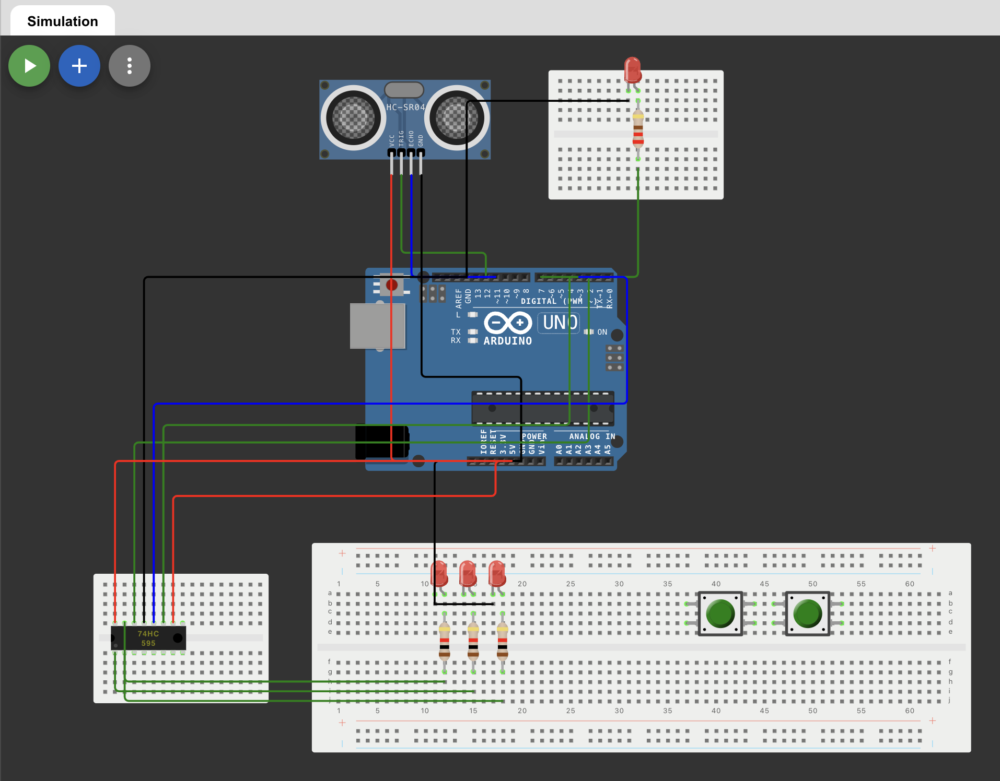

# Collision Detection and Alert System

## Table of Contents
- [Project Overview](#project-overview)
- [Features](#features)
- [Circuit Design](#circuit-design)
- [Installation and Setup](#installation-and-setup)
- [Usage](#usage)

## Project Overview
This project was developed as part of the UC Davis AvenueE, a STEM Scholarship program designed for transfer students in engineering. This project was facilitated by a UC Davis professor, Christopher Nitta, who is working on devloping key features for his ongoing EcoCAR EV challenge. Our team of 3 students collaborated over the course of one week to design and implement a system that enhances road safety by detecting collision risks. The system emits sound alerts when a potential collision is detected. Additionally, we programmed a remote control to adjust the sensitivity of the sensor to emit louder sounds and flash lights more rapidly as needed.

## Features
- **Collision Detection**: Uses an ultrasonic sensor to detect approaching objects.
- **Sound Alerts**: Emits a buzzer sound when an object is detected within a close range.
- **Visual Alerts**: Sequentially illuminates red LEDs as the object approaches the senso.

## Circuit Design
The system is built using the following:
- **Ultrasonic Sensor**: Measures the distance of objects.
- **Passive Buzzer**: Emits a sound when an object is detected within a set threshold.
- **Red LEDs**: Illuminate sequentially as the object moves closer.
- **Arduino Board**: Controls the logic and outputs.

The wiring connects the ultrasonic sensor, buzzer, and LEDs to the Arduino, with the circuit designed to maximize responsiveness and road safety.



## Installation and Setup
1. **Clone the repository**:
   ```bash
   git clone https://github.com/vhangsan/arduino_carproject.git
   ```
2. **Upload Arduino code**:
- Open the Arduino IDE or use online simulator: `https://wokwi.com`
- Load project `.ino` and `.json` files.
- If using a physical setup, connect Arduino board to computer.
- Upload code to the Arduino.

3. **To Set Up Physical Circuit**:
- Refer to circuit image as shown above in circuit design.

4. **Power System**:
- Once circuit is assembled, power the Arduino via USB or external power source.

## Usage
When an object approaches the ultrasonic sensor, the red LED lights will light up sequentially, and the buzzer will emit a warning sound to signal that an object is too close, indicating a potential collision risk.